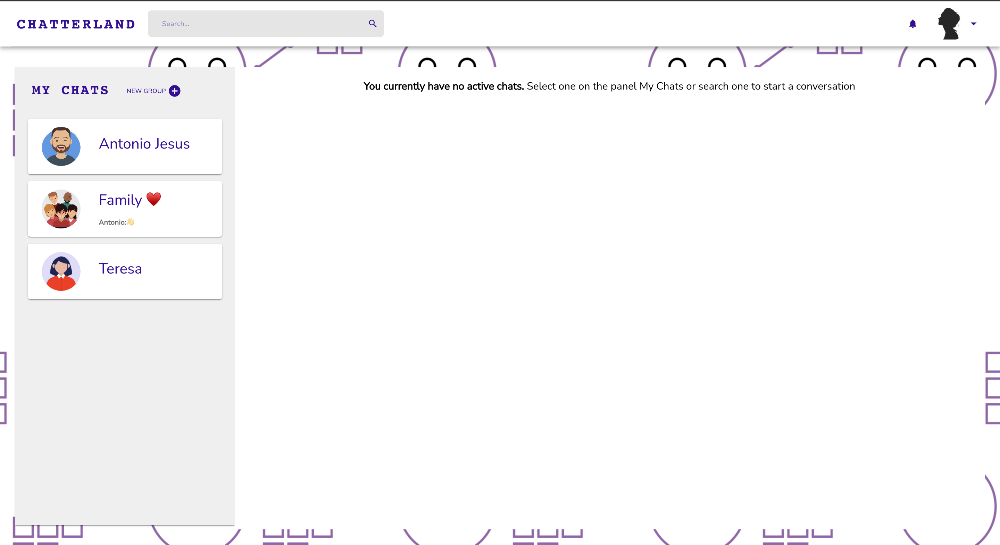
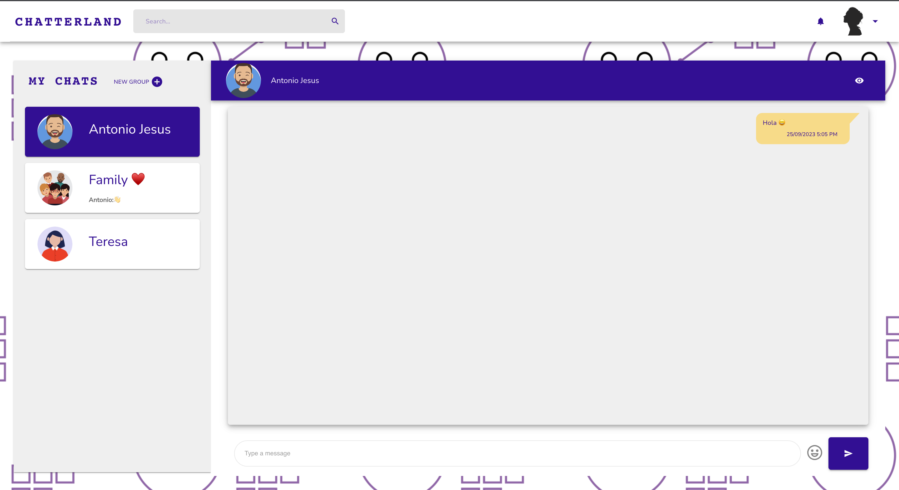
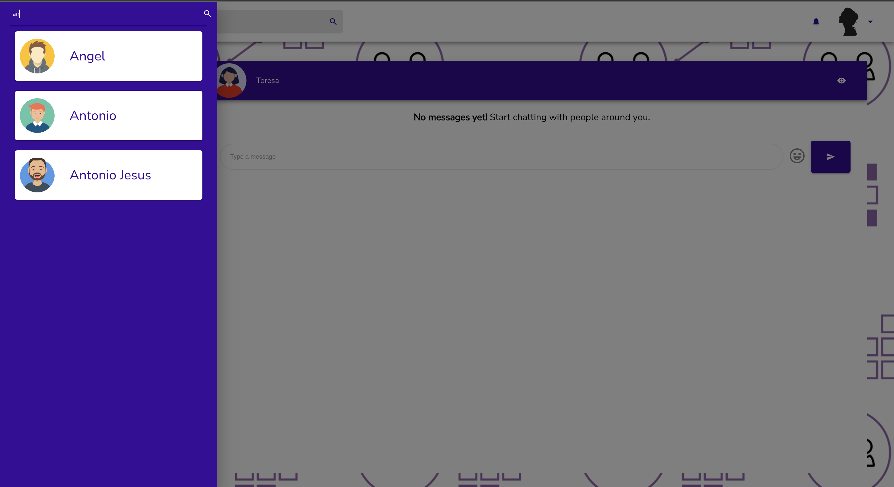
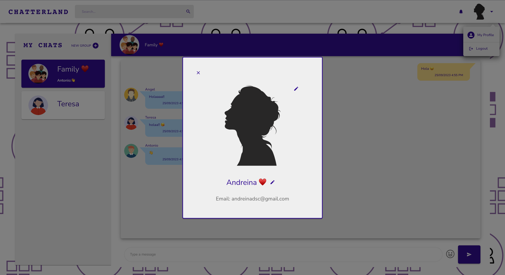
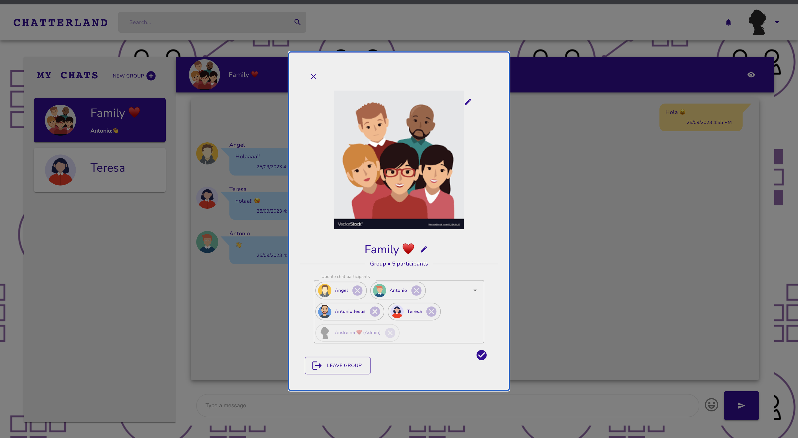
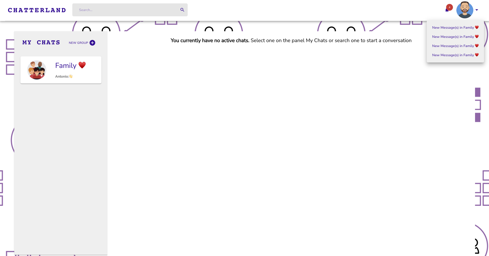

<!-- PROJECT LOGO -->
 

  
  <h3 align="center">Chatterland</h3>
  

     
    <a href="https://chat-app-1993.netlify.app/">View Demo</a>
    ·
    <a href="https://github.com/andreinadsc/chat-app/issues">Report Bug</a>
  

  
Table of Contents

  <ol>
    <li>
      <a href="#about-the-project">About The Project</a>
    </li>
    <li>
        <a href="#built-with">Built With</a>
    </li>
    <li>
      <a href="#getting-started">Getting Started</a>
    </li>
    <li>
        <a href="#contact">Contact</a>
    </li>
  </ol>

## About The Project

A simple math game with with vanilla js

(<a href="#readme-top">back to top</a>)

## Built With

### Client

- 
- 
- 
- 
- 

### Server

- 
- 

(<a href="#readme-top">back to top</a>)

<!-- GETTING STARTED -->

## Getting Started
Chatterland is a Full Stack Chatting App. Uses Socket.io for real time communication and stores details in a Mongo  Database.

<!-- CONTACT -->
## Contact

María Andreina Da Silva - andreinadsc@gmail.com

(<a href="#readme-top">back to top</a>)

